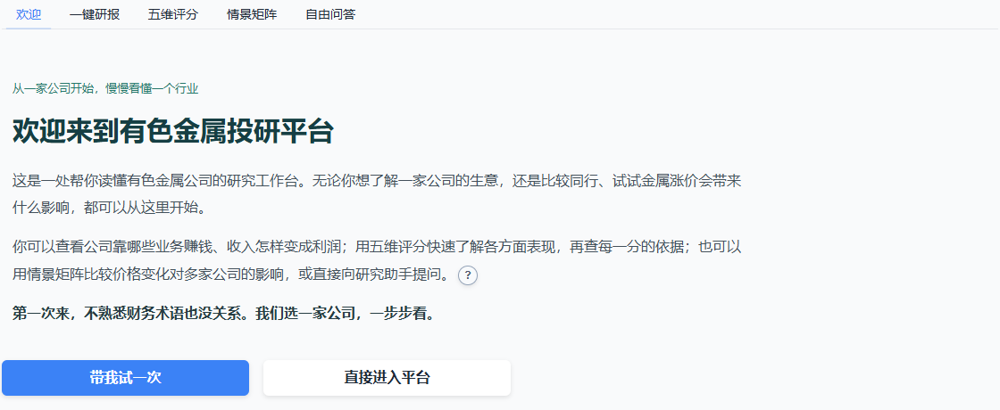
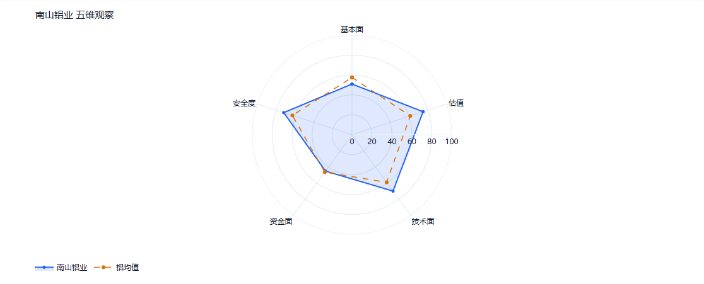
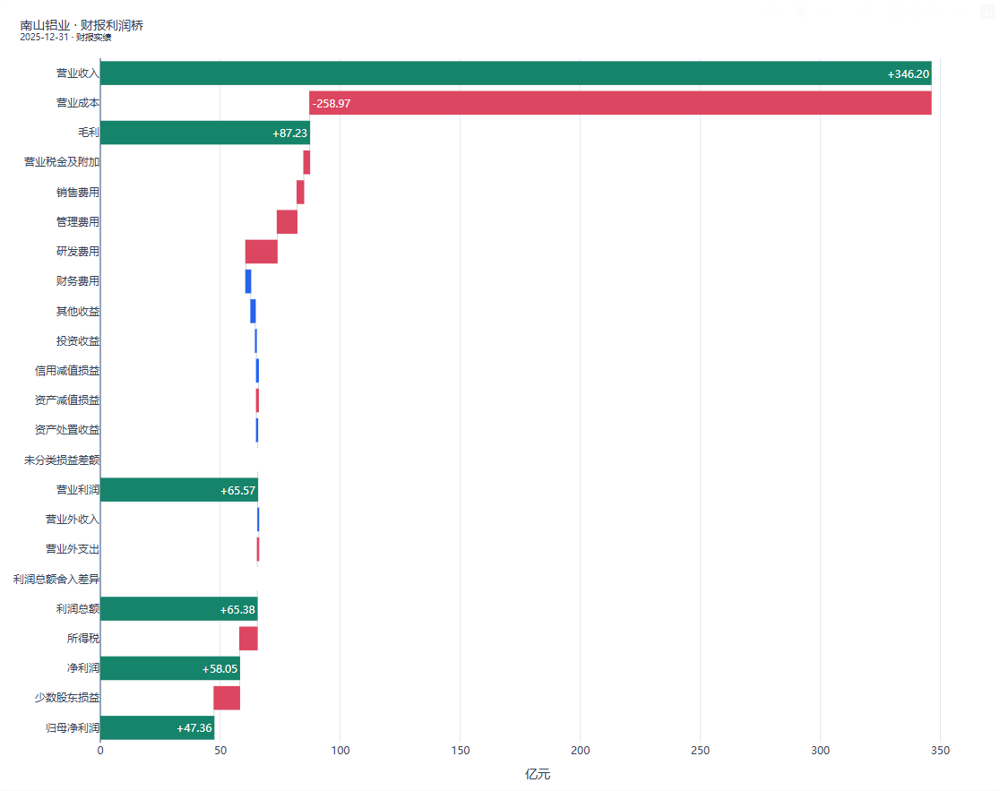
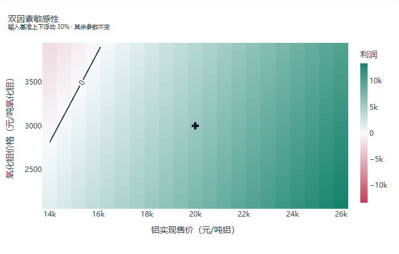
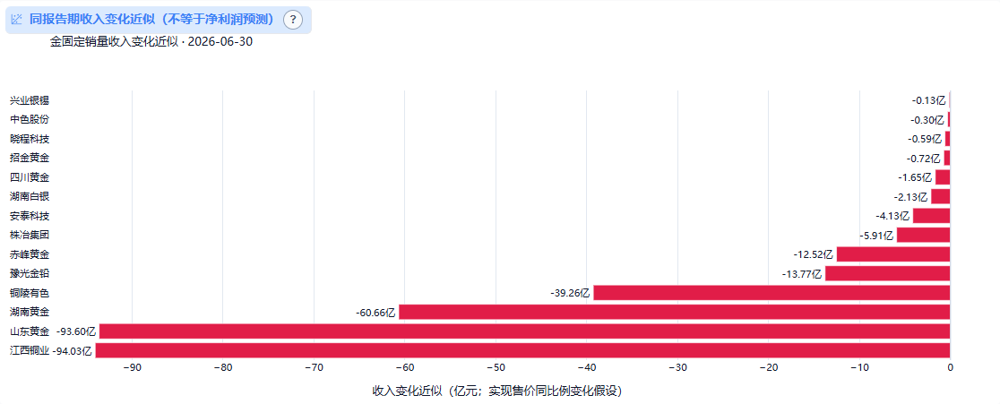

# 有色智研 · 有色金属投研智能体

面向有色金属公司研究的交互式投研工作台。项目把财报勾稽、五维评分、利润拆分、经营情景和研究问答放在同一条流程中，帮助用户从“公司靠什么赚钱”逐步追查到“利润怎样形成、假设变化会带来什么影响”。

> 当前项目用于研究辅助与比赛展示，不提供自动交易、买卖建议或收益保证。评分与情景结果必须结合原始披露复核。

[下载项目演示 PPT](docs/有色智研-项目演示.pptx) · [查看项目说明](docs/项目说明.md) · [查看五维评分规则](docs/五维评分规则.md)

## 界面预览

### 从欢迎页开始

首页用自然语言说明平台用途，并提供十二步新手引导。熟悉流程的用户也可以直接进入研究页面。



### 五维评分与同业比较

评分覆盖基本面、估值观察、技术面、资金面和安全度。页面同时展示公司、子板块均值、原始指标、计分阈值、数据日期和缺项；只有五维完整时才计算综合分。



### 财报利润桥

利润桥从营业收入和营业成本开始，继续展开费用、其他损益、所得税及少数股东损益，并保留未分类差额和勾稽异常。图中为南山铝业 2025 年报的本地研究结果。



### 经营情景与板块矩阵

七类经营模型分别处理矿山采选、外购精矿冶炼、电解铝、金属加工、化合物与分离、再生回收、贸易与供应链。热力图中的参数是显式假设，不冒充企业实际成本。



板块矩阵使用同报告期、可独立识别的分部收入，计算固定销量下的收入变化近似。它不是净利润预测，也不是股价涨跌预测。



## 主要能力

- 一键研报：基本面、估值、技术面、资金面与风险分区呈现，图表和正文共用一次捕获的研究上下文。
- 五维评分：公开权重、阈值和原始输入；缺项不补零，不对剩余维度重新加权。
- 利润分析：财报利润桥、分部毛利和已披露单位经济性分开呈现。
- 经营情景：7 类业务模型及双因素敏感性图，明确单位、成本边界和假设。
- 板块比较：同报告期收入冲击矩阵及子板块排名悬停预览。
- 研究问答：15 个注册工具覆盖财务、估值、行情、宏观、风险、利润与情景计算。
- 易用性：十二步教程、术语速查、图表问号解释和桌面/手机适配。

当前研究池配置为 140 家 A 股有色公司。最近发布的五维 v2 快照中，61 家五维完整；财务期间为 2025-12-31，完整样本的市场日期为 2026-09-04。数据缺失、接口失败和指标不适用均保留原状态。

## 技术结构

```text
webui.py / onboarding.py        交互界面与新手流程
agent.py / report.py            工具编排、问答与研报生成
scoring.py / score_*.py         五维规则、快照和同业比较
profit_ui.py / profit_charts.py 利润桥、分部毛利与情景图
tools/                          15 个确定性研究工具
tests/                          单元测试与浏览器回归脚本
```

大模型负责工具选择和文字组织；评分、会计勾稽及经营情景由确定性函数计算。确定性计算降低了数字漂移，但不保证模型的每句解释都正确。

## 本地运行

建议使用 Python 3.12 和独立虚拟环境：

```powershell
python -m venv .venv
.venv\Scripts\Activate.ps1
python -m pip install -r requirements-lock.txt
Copy-Item .env.example .env
python webui.py --port 7860
```

浏览器打开 `http://127.0.0.1:7860`。LLM 问答和完整研报需要在 `.env` 中配置 OpenAI 兼容接口；基于本地缓存的财务图表和确定性情景不依赖模型生成正文。

命令行入口：

```powershell
python main.py "分析南山铝业的财报利润和分部毛利"
```

## 数据准备与公开边界

仓库不包含 Wind 原始文件、授权受限的本地缓存、模型密钥、研究运行记录或完整公告材料。所需目录和文件口径见 [data/README.md](data/README.md)；公开接口数据也应由使用者自行核实授权与使用条款。

Wind 补充模块只在本地读取用户导出的文件，生成的派生结果保存在被忽略的 `data/wind_import/`，不会送入模型，也不会写入公开评分快照。项目展示材料没有包含 Wind 原始数据。

## 验证

```powershell
python -m pytest -q
python scripts/audit_profit_analysis.py
```

项目曾完成 341 项全量测试，并对多家公司利润图、七类经营情景、排名悬停、新手教程及桌面/手机流程做过浏览器回归。后续 Wind 补充和技术面校验另有专项测试；仓库不把历史测试记录表述为最新全量结果。

12 道已知开发任务中，固定工具流程通过 12 道，自由 Agent 通过 6 道，直接回答通过 2 道。这组评测用于验证受约束流程，题目并非盲测，也不代表实盘表现。详见 [评分与问答改进记录](docs/评分与问答改进记录.md)。

## 更多文档

- [项目说明](docs/项目说明.md)
- [五维评分规则](docs/五维评分规则.md)
- [利润拆分体系设计](docs/利润拆分体系设计草案.md)
- [利润数据来源与覆盖](docs/利润数据来源与覆盖.md)
- [新手引导说明](docs/新手引导说明.md)
- [复现与数据边界](docs/复现与数据边界.md)
- [投研任务评测](docs/投研任务评测.md)

比赛页面：[北京大学金融 AI 智能体创新大赛](https://bigquant.com/square/competition/1ae09428-2cce-4514-bc89-5abdf754139f)
